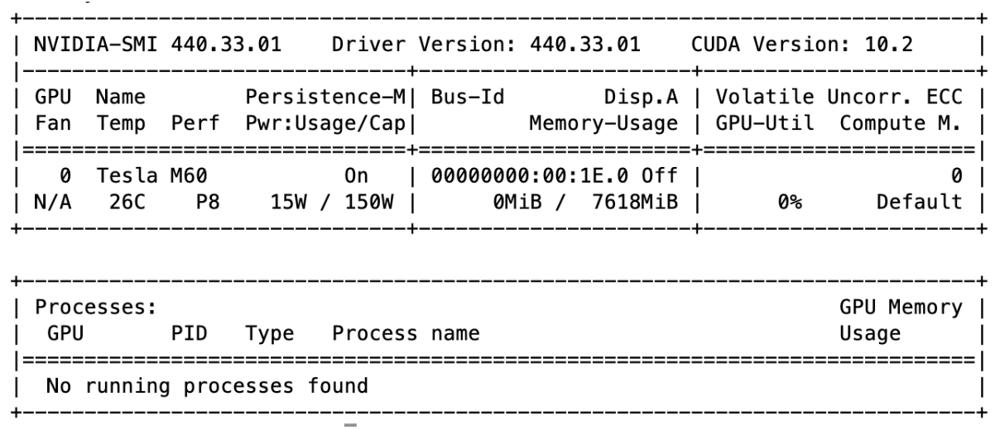

# Large-Scale Distributed Private Learning with DPSGD

Harvard CS205 Final Project, Spring 2020

Tianhao Wang, Litao Yan, Ruoxi Yang, Silin Zou

## Introduction
Differential privacy is a framework for measuring the privacy guarantees provided by an algorithm. We can design differentially private machine learning algorithms to train on sensitive data. It provides provable guarantees of privacy, reducing the risk of exposing sensitive training data through the learned classifier. In the context of deep learning, differential private stochastic gradient descent, or the DPSGD, is the state-of-art algorithm to train such a privacy-preserving neural network. Nowadays, the DPSGD algorithm is in urgent need of combining with big compute and big data technology. On the one hand, due to the features of the DPSGD algorithm, such as limiting the gradient size in each step of parameter update, its convergence time will be 10 to 100 times longer than that of the original SGD algorithm. On the other hand, the datasets processed by DPSGD will be up to thousands of petabyte. In this project, we implemented data processing steps through training by Spark, and in the training process, we used distributed training. We employ Spark on AWS cluster to first preprocess the large amount of data. After processing the data, we use AWS GPU clusters to distribute the workload across multiple GPUs to speed up DPSGD training, where multi-GPU commucation is enabled by PyTorch Distributed Module with NCCL backend.

We demonstrate the details of this project [here](https://yanlitao.github.io/fastDP).

## Main Features

### Overview DPSGD Algorithm
As an optimization method, differential private SGD is developed from original SGD. In the process of parameter updating, there are two more important steps for DPSGD in each iteration: gradient clipping and noise addition. These two steps reduce the effect of one single anomaly so that the results of two similar datasets will not be too different. In our profiling analysis, these two steps are also the time-consuming hot-spot. 

### Dataset
Our data comes from American Community Survey Public Use Microdata Sample (PUMS) files. It includes useful but somehow sensitive census information such as Sex, Marrital Status, College degree. Our task is to privately train a deep learning model to predict the unemployment rate based on other demographic information using DPSGD, with the aid of big data and HPC tools so that we can both protect privacy as well as obtain a satisfiable runtime of the algorithm.

### Solutions
Our solution separates into two stages, data preprocessing and the DPSGD training. Accordingly, the levels of parallelism we are implemented are **big data** and **distributed parallelization technology**. To be more specific, within the data preprocessing stage, we use Spark to process large amount of data. This is because in our experiments, Spark runs much faster than MapReduce. For the model training stage, we specifically designed a new distributed version of DPSGD with gradient AllReduce step. We implemented two versions of distributed parallelism of DPSGD, one is based on PyTorch Distributed Data Parallel module and another one is implemented from scratch, where multi-GPU communication is based on PyTorch distributed package with NCCL backend. 

In terms of the infrastructure, since we didn't get approve from AWS to get more than 5 g3.4xlarge instances, we use at most 4 g3.4xlarge (or 2 g3.8xlarge, or 1 g3.16xlarge) instances to run the distributed version of DPSGD. 

## Replicability Information: Data Processing

### MapReduce

**1. Launch Hadoop EMR cluster**

a. login **AWS EMR** and select **Create cluster**. You can select the following configuration:
    
	ClusterName: MyMapReduce
        
	Launch mode “Cluster”
        
	Release: 5.29.0
        
	Applications: Core Hadoop
        
	Instance type: m4.xlarge
        
	Number of Instances: 3
   
b. Click on “Create Cluster” and wait for the cluster to be ready. The cluster is ready when its state is “Waiting” and the Master and Core under the **Networks and hardware** section are both in “Running” state.
   
**2. Submit a MapReduce job**

a. Upload `mapper.py`, `reducer.py` and raw dataset `CaPUMS5full.csv` to a new S3 bucket. Create a S3 bucket, and name it.
    
b. Go to the Hadoop cluster dashboard’s **Steps** tab and click on “Add Step” with the following configuration:
    
	Step type: Streaming program
        
	Name: MyHadoopJob
        
	Mapper: Complete path to uploaded mapper
        
	Reducer: Complete path to uploaded reducer
        
	Input: Complete path to uploaded input files
        
	Output: Complete path to new folder to be created with the output (it should not exist)
     
c. Wait for the “step” to be “completed”;
     
d. After “completed” you can check the execution time in the `controller` log file;
     
e. If the job is not successfully “completed”, you can check the logging files for further information;
     
f. Finally, check the results in the bucket, Hadoop creates one output file for each executed reducer task.
     

### Spark

**1. Launch Hadoop EMR cluster**

a. login **AWS EMR** and select **Create cluster**. You can select the following configuration:
    
	ClusterName: MySpark
        
	Launch mode “Cluster”
        
	Release: 5.29.0
        
	Applications: Spark
        
	Instance type: m4.xlarge
        
	Number of Instances: 3
        
b. Click on “Create Cluster” and wait for the cluster to be ready. The cluster is ready when its state is “Waiting” and the Master and Core under the Networks and hardware section are both in “Running” state;
    
**2. Login to the cluster**
    
a. Write down the “Master public DNS” and click on the SSH link next to it. The SSH link gives you the commands you might use to login to your cluster;
    
b. SSH to the machine using the private key. A sample command is as depicted (modify accordingly). `$ ssh -i $HOME/.ssh/course-key.pem hadoop@ec2-34-229-72-173.compute-1.amazonaws.com`

**3. Submit a Spark Script** 
    
a. Upload to the master VM the Spark `spark_process.py` script and the `CaPUMS5full.csv` file;
    
b. Upload the `CaPUMS5full.csv` file to the Hadoop file system: 
        
`$ hadoop fs -put CaPUMS5full.csv`
        
**4. Parallel Execution on Multiple Nodes**

a. Using the following command to execute the script on **1 executors** (worker nodes) with **4 threads per executor**, achieving the execution of **4 simultaneous tasks**:
    
`$ spark-submit --num-executors 1 --executor-cores 4 spark_process.py`

## Replicability Information: Distributed DPSGD with GPU acceleration

### Infrastructure Deploying & Environment Setup

**1. Creating the Nodes**

a. login **AWS EC2** and select **Launch Instance**.
  
b. Choose an **Amazon Machine Image (AMI)** - Here we will select the **Deep Learning AMI (Ubuntu 16.04) Version 28.1**. 
  
c. Choose an Instance Type - Choose **g3.4xlarge** for testing multiple nodes with 1 GPU each; choose **g3.8xlarge** for testing multiple nodes with multiple GPU;
  
d. Configure Instance Details - We only need to increase the **number of instances** to **2**;
  
e. Add Storage - The default setting of storage is only 75 GB, which is enough for our dataset;
  
f. Add Tags - Directly click on the next step;
  
g. Configure Security Group - create a new security group for the two nodes to be in. Remember your new security group name (e.g. dpsgd-secgroup) which will be used later;
  
h. Review Instance Launch - review the instance then launch it; 

i. Go to "Security Groups" and edit the rules for the security group you created at step g:

- Inbound Rules: add rule that allow all traffics as Source.
- Outbound Rules: Same as inbound.

**2. Environment Setup**
  
a. Activate the pytorch environment: `source activate pytorch_p36`;
  
b. Install the latest Pytorch 1.1: `conda install pytorch cudatoolkit=10.0 -c pytorch`;
  
c. Find the name of private IP of the node by running `ifconfig` (usually `ens3`) and export it to NCLL socket: `export NCCL_SOCKET_IFNAME=ens3` (add to `.bashrc` to make this change permanent);
  
d. Upload code files to each node, or simply `git clone` from the repository;
  
e. Also, upload the data to each node if running without NFS (Network File System) setup;
  
f. Repeat above steps on each node.

**3. Set up NFS**

We use `master$` denote master node and `$node` denote any other nodes.
  
Run the following commands on master node:
  
a. Install NFS server: `master$ sudo apt-get install nfs-kernel-server`;
  
b. Create NFS directory: `master$ mkdir cloud`;
  
c. Export cloud directory: by executing `master$ sudo vi /etc/exports` to open the `/etc/exports` and add `/home/ubuntu/cloud *(re,sync,no_root_squash,no_subtree_check)` to it;
  
d. Update the changes: `master$ sudo exportfs-a`;
  
Configure the NFS client on other nodes:

a. Install NFS client: `node$ sudo apt-get install nfs-common`;
  
b. Create NFS directory: `node$ mkdir cloud`;
  
c. Mount the shared directory: `node$ sudo mount -t nfs <Master Node Private IP>:/home/ubuntu/cloud /home/ubuntu/cloud`;
  
d. Make the mount permanent (optional): add the following line `<Master Node Private IP>:/home/ubuntu/cloud /home/ubuntu/cloud nfs` to `/etc/fstab` by executing `node$ sudo vi /etc/fstab`.

### Running the Program

**1. Getting the code processed data**

Get the processed data file in hdf5 format from our project S3 bucket. The data format will be slightly different for Code Version 1 and 2. 

Code Version 1: 
```
wget https://cs205-dpsgd-dataset.s3.amazonaws.com/dataset_package.h5
```

Sequential and Code Version 2:
```
wget https://cs205-dpsgd-dataset.s3.amazonaws.com/dataset.h5
```


**2. Runnng the sequential version of DPSGD**

We use json file to store and load training parameters. 

Run the following command on one node:
```
python seq_main.py --settings_path=<path of json file for training parameters> 
```

For example, if the parameter settings are stored in `config/seq_train.json`, then simply run 
```
python seq_main.py --settings_path="config/seq_train.json"
```

If you want to profile the sequential code and analyze the "hot-spot" of the program, you can use python `cProfile` library, and run command:
```
python -m cProfile -o seq_main.profile seq_main.py --settings_path="config/seq_train.json" 
```

Here's the interpretation of training parameters in `config/seq_main.json`:

 * num_epoch: total number of epochs
 * path: path of the training data (the .h5 file downloaded from S3)
 * l2\_norm\_clip: gradient norm bound (privacy parameter)
 * noise_multiplier: gradient noise multiplier (privacy parameter)
 * batch_size: training batch size
 * minibatch_size: minibatch size for gradient clipping
 * lr: learning rate


**3. Run version 1 of distributed DPSGD (based on DistributedDataParallel module)**

```
python dist_main_v1.py --settings_path=<path of json file for training parameters> --rank=<global rank of current process> --local_rank=<local rank of current process>
```

For example, if setting parameters are stored in `config/dist_train.json`, and we have 2 nodes and each with 1 GPU, we can run
```
python dist_main_v1.py --settings_path="config/dist_train.json" --rank=0 --local_rank=0
```

on the first node, and run 
```
python dist_main_v1.py --settings_path="config/dist_train.json" --rank=1 --local_rank=0
```
on the second node. 

The extra distributed training parameters in `config/dist_train.json` are:
 
 * world_size: total number of processes
 * master_ip: private ip addr of master node
 * master_port: a free port of master node
 * dist_backend: backend of PyTorch Distributed Library
 * rank: the global rank of current process
 * local_rank: the local rank of the current process (i.e. the ith GPU in the node)


**4. Run version 2 of distributed DPSGD (implemented from scratch)**
	
When all of the nodes have only one GPU device, the way to run Version 2 of code is exactly the same as the way to run Version 1. 
	
When we have nodes that contain multiple GPUs (e.g. g3.8xlarge or g3.16xlarge), for the first process that uses device `'cuda:0'`, the command are exactly the same as above. However, process that uses device 'cuda:x', we should run:  
```
CUDA_VISIBLE_DEVICES=x python dist_main_v2.py --settings_path=<path of json file for training parameters> --rank=<global rank of current process> --local_rank=<local rank of current process>
```
	
For example, when we are using one g3.8xlarge node with 2 GPUs, for the process that uses `'cuda:1'`, we should run 
```
CUDA_VISIBLE_DEVICES=1 python dist_main_v2.py --settings_path="config/dist_train.json" --rank=1 --local_rank=0
```

Note that here the local rank of this process is 0 since this process only sees one GPU device. `CUDA_VISIBLE_DEVICES=1` is mainly used to prevent runtime error that arguments may contain in different GPUs. 
	
	
## System Information

### Software Version
- Python 3.6.5
- PyTorch 1.1.0

### CUDA GPU Information



### AWS Instance Information (g3.4xlarge)


### Operating System 


